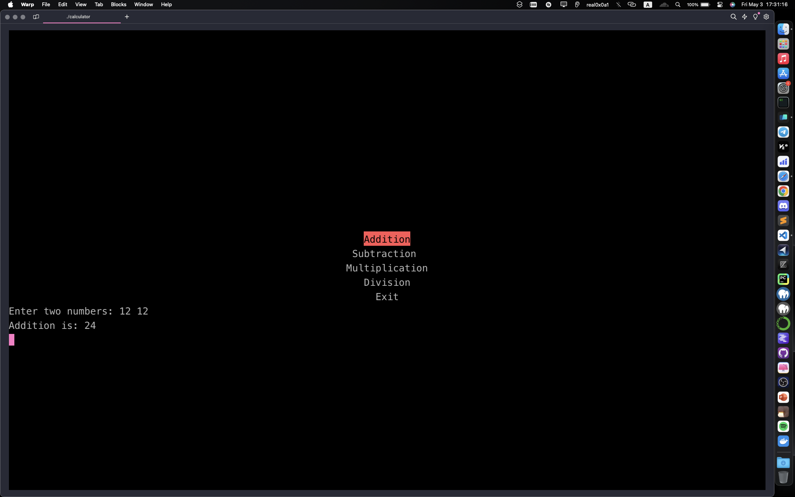

Sure, here's a suggestion for the repository name and a README.md file:

**Repository Name:**
"SimpleCalculatorNCurses"

**README.md:**

````markdown
# Simple Calculator using NCurses

This repository contains a simple calculator program implemented in C++ using the NCurses library. The calculator allows users to perform basic arithmetic operations such as addition, subtraction, multiplication, and division.

## Features

- User-friendly interface implemented with NCurses.
- Supports addition, subtraction, multiplication, and division operations.
- Error handling for division by zero.

## Dependencies

- NCurses library

## Usage

1. Clone the repository to your local machine.
2. Compile the program using a C++ compiler.
3. Run the executable.
4. Use the arrow keys to navigate through the options and press Enter to select.
5. Follow the on-screen instructions to input numbers and perform calculations.

## How to Compile

```bash
g++ -o calculator SimpleCalculatorNCurses.cpp -lncurses
```
````

OR

```bash
make SimpleCalculatorNCurses
```

## Usage Example



## Contributing

Contributions are welcome! If you have any suggestions or improvements, feel free to open an issue or submit a pull request.

```


## Author

- Ali (Real0x0a1)

---
```
